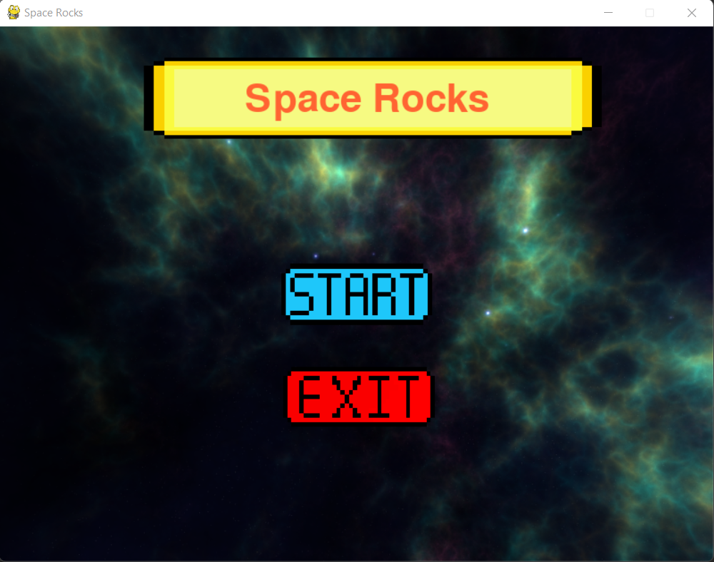
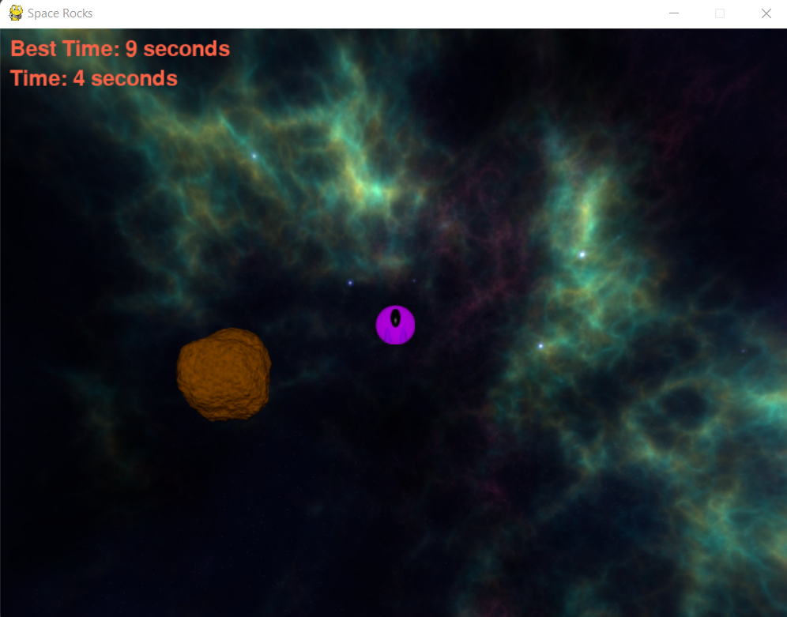
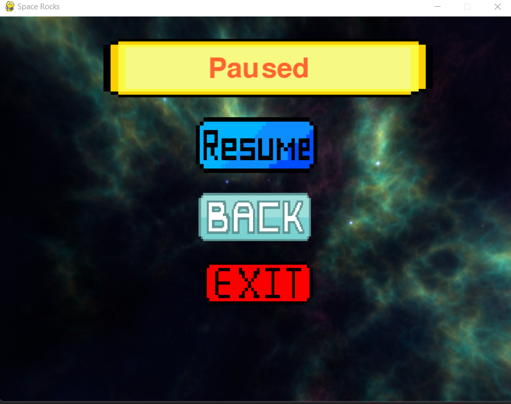
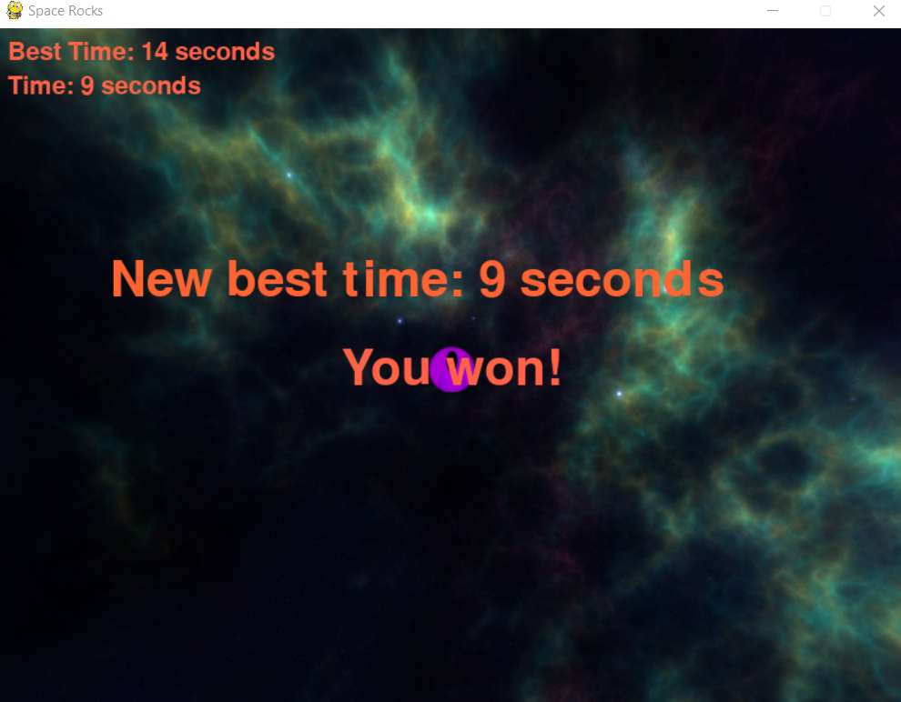

# AlgoProFinalProject
This project is an update for a source code of an Asteroids game i found online:

https://realpython.com/asteroids-game-python

Video link: https://drive.google.com/file/d/1CQINuDR9WY_YKpPnDGYtDmgjb4er9p-w/view?usp=sharing

## Description of things i added:
- A score system, the user in the local device that completes the game at the lowest time will get the best time, that time will then be displayed on the screen
- A pause button, users can pause
- A start menu, game does not immediately start
- Background music, i added two backgorund music, one for the menu and one for the game itself

## Screenshots

